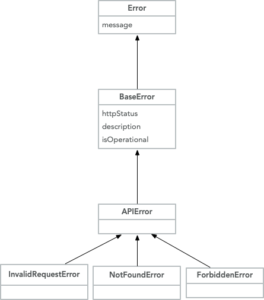

# javascript-error-handler
Create a simple error handler having two type of errors:

- **Operational errors**: represent runtime problems whose results are expected and should be dealt with in a proper way. Operational errors don’t mean the application itself has bugs, but developers need to handle them thoughtfully. Examples of operational errors include “out of memory,” “an invalid input for an API endpoint,” and so on.

- **Programmer errors**: represent unexpected bugs in poorly written code. They mean the code itself has some issues to solve and was coded wrong. A good example is to try to read a property of “undefined.” To fix the issue, the code has to be changed. That is a bug a developer made, not an operational error.

The application has some business rules that will throw custom errors that will be intercepted by the error handler.

